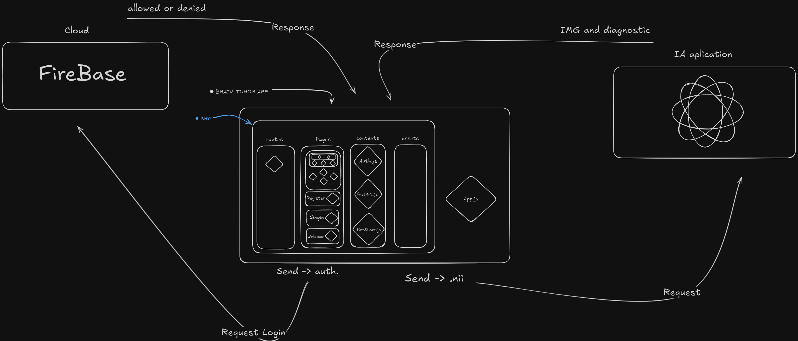

# Brain Scan Diagnostic App 🧠

This application, built with **Expo** and **React Native**, helps analyze and classify brain scan images by associating them with specific diagnostic insights. The app processes `.nii` files (Neuroimaging Informatics Technology Initiative format) and provides automated feedback for each scan with IA.

## 🚀 Features

- Automatic classification of brain scans based on IA.
- Provides detailed medical insights like **necrosis**, **edema**, and **tumor enhancement**.
- Implements **delayed comment delivery** for smoother front-end interaction.
- Built with **Expo**, offering cross-platform support for Android and iOS.
  
## 📂 File Structure

        /BrainScanApp 
        ├── App.js 
        ├── src/ 
        │ └── contexts/
        │ └── assets/
        │ └── routes/
        │ └── pages/
        ├── README.md 
        └── package.json

## 🛠️ How It Works

1. Upload `.nii` files through the app interface.
2. Based on the analyzes, the app assigns specific comments:
   - **Necrótico e sem realce**
   - **Edema peritumoral**
   - **Tumor com realce Gd**
   - **Others**: Arquivo sem diagnóstico identificado.

## 🧑‍💻 Prerequisites
- Node.js installed
- Expo CLI installed
- A mobile emulator or Expo Go app on your phone for testing

## ⚙️ Installation
1. Clone the repository:
    ```
    git clone https://github.com/HenryFacens/brainTumorApp.git
    cd brainTumorApp
2. Install dependencies:
    ```
    npm install
3. Start the Expo development server:
    ```
    npx expo start
4. Open the app on your mobile device using the Expo Go app or an emulator.

## 🧪 Testing
You can test the comment logic by uploading test files named:
- `patient001_predict.nii`
- `patient002_predict.nii`
- `patient003_predict.nii`

## 🖼️ Screenshots

### Struct

### Login

### Auth

### Home

### Response
